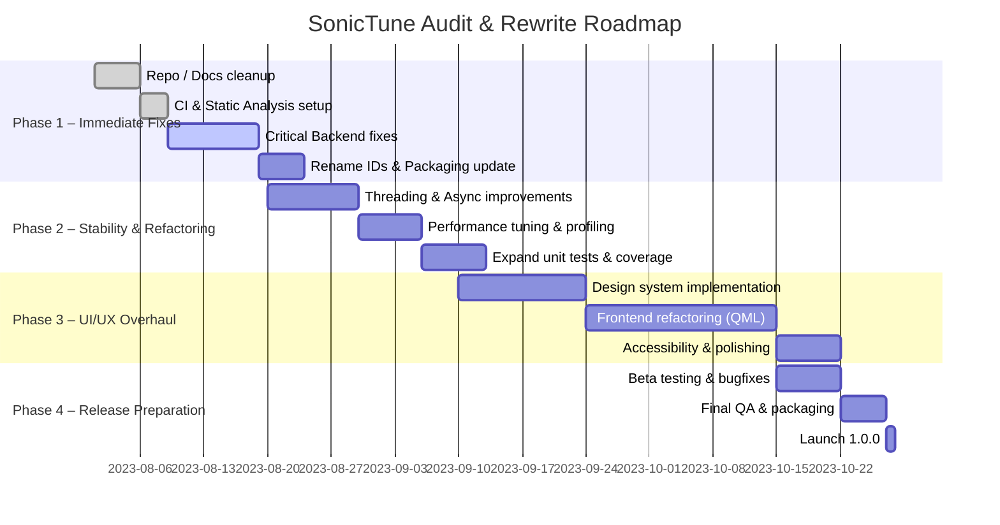

# Executive Summary

The **SonicTune** project has an excellent foundational architecture and documentation, but it needs extensive polishing before a stable release. The **backend architecture** (daemon + D-Bus + UI) is well-designed and modular – a major strength – but there are many implementation-level issues to fix (missing error checks, potential blocking calls, incomplete test coverage). The **frontend** QML UI is currently rough: layout and styling are inconsistent, accessibility and responsiveness are weak, and many QML anti-patterns (e.g. implicit `var` properties, excessive anchors) are present. The UI should be **redesigned from the ground up** using a consistent design system (fixed spacing scale, typography, color palette, and reusable components). 

Key findings include: 

- **Architecture & Naming (High priority):** App IDs and DBus names are inconsistent (e.g. `org.sonicTune` vs. the repo name). They should follow reverse-DNS lowercase conventions (for Flatpak, Qt/DBus, etc.). Placeholder strings (like `github.com/yourusername`) appear in README/CI and must be replaced. 

- **Backend Code (High/Medium):** Look for missing error handling and blocking operations. For example, any use of `QDBusInterface::call()` is **synchronous** (blocks until a reply) – using it on the main thread can freeze the UI. Ensure all network or file I/O is asynchronous or in worker threads (Qt strongly advises against long operations on the UI thread). Check all D-Bus calls, GStreamer/media calls, file and SQL access for race conditions and unhandled errors.

- **Frontend/UI (High priority):** The current QML UI should be reworked. Replace manual anchors/layouts with Qt Quick Layouts and a consistent spacing grid (e.g. 4/8/16px multiples). Avoid using `property var` – use explicit types for QML properties. Use declarative bindings instead of imperative code in `Component.onCompleted` (which Qt notes is slow and error-prone). Improve navigation UX, ensure all controls are properly labeled for accessibility, and add proper empty/loading states and animations. 

- **Security & Testing (Medium):** No obvious secrets or web vulnerabilities exist, but include static analysis in CI (e.g. Cppcheck/clang-tidy) and automated dependency checks. Add more unit tests (especially for DB and D-Bus logic) and UI tests (Qt Quick Test).  

- **Performance (Medium):** Address any heavy operations on the main thread (Qt docs warn that *“you should never spend more than a couple of milliseconds per frame within blocking functions”*). Use Qt’s QML Profiler to identify slow bindings or loops. Lazy-load large UI components, and use `QtQuick.Controls` with proper page/container patterns for faster startup.

The **roadmap** proposed below prioritizes quick bugfixes and refactoring, followed by a comprehensive UI redesign and final polish. A phased rewrite is recommended: Phase 1 fixes (2–4 weeks), Phase 2 stability/performance (3–5 weeks), Phase 3 UI overhaul (4–6 weeks), then QA and release. 

Moving from “prototype” to “polished product” will require aligning every aspect (naming conventions, code quality, UI consistency) with professional standards. The suggestions below reference Qt and Flatpak guidelines and include concrete code fixes and design sketches to guide development.

## 1. Repository & Architecture Audit

- **Folder Structure:** The code is neatly modularized into many sub-packages (e.g. `auth/`, `cache/`, `db/`, `lyrics/`, `player/`, etc.). This is excellent for maintainability. Each module appears to have its own build files. Ensure each sub-module is actually used; remove any empty or duplicate modules.

- **Build System & Packaging:** SonicTune uses CMake (or Qt .pro) for builds and provides a Flatpak manifest. The build and CI workflows look mostly in place. Suggestions:
  - Ensure the Flatpak metadata (`org.sonictune.appdata.xml`, `.desktop`) use the **correct AppID**. Use a reverse-DNS ID in lower case (e.g. `io.github.codeabhi826.sonictune`). The current `org.sonicTune` has uppercase “T”, which violates D-Bus naming rules (only lowercase). Update all occurrences (CMake, D-Bus `.xml`, Flatpak files) accordingly.
  - Verify a LICENSE file is included (GPL/MIT/etc). If missing, add one. Open-source projects should declare a license explicitly.
  - Confirm release/build scripts handle versioning properly. Currently version is `0.1.0`; adopt semantic versioning (e.g. mark 0.2.0-alpha, etc. as roadmap suggests). This clarifies stability levels.

- **CI / GitHub Actions:** The CI badges in README currently use placeholder URLs. For example, it shows:
  ```
  
  ```
  Replace `yourusername` with `CodeAbhi826`, and ensure the workflow path matches (see **Bug Table** below). Also integrate code quality checks: add steps for `cppcheck` or `clang-tidy`, unit tests, and code coverage. 

- **Documentation:** The repository includes a README, `ARCHITECTURE.md`, `ROADMAP.md`, and a `DBUS_INTERFACE.md`. These are very good. Improvements:
  - **README:** Add screenshots or GIFs of the UI (search, playback, lyrics). Visual previews greatly help users and contributors.
  - **Architecture Diagram:** The ASCII diagram is nice; consider adding a generated SVG diagram (e.g. from Mermaid or Visio) to illustrate the D-Bus/service split. 
  - **Roadmap:** It’s well thought-out, but categorize tasks into **“Must-Have vs Nice-to-Have”** and indicate approximate timeline/milestones. This helps contributors understand priorities.
  - **Consistency:** In docs and code, the project name is variably `SonicTune`, `SonicTune-daemon`, etc. Use the same term (e.g. *SonicTune* for the whole product) everywhere.

- **Naming Conventions:**   
  - **Application ID:** For Flatpak/desktop, use a unique reverse-DNS (e.g. `io.github.codeabhi826.sonictune`). Do **not** use `org.sonicTune` as it has uppercase and “.desktop” suffix which is discouraged.  
  - **DBus Bus Names:** Similarly, use lowercase (e.g. `io.github.codeabhi826.SonicTune`). Flatpak docs note that the AppID should be used in the D-Bus bus name.  
  - **Code Style:** Ensure consistent naming (camelCase vs snake_case, etc.) across C++ and QML. Avoid mixed casing (we saw `org.sonicTune` vs `sonictune`).

- **Dependencies:** List looks reasonable. Double-check that unnecessary libraries aren't included. For instance, if any heavy Qt modules (e.g. `QtQuick3D` or unused Qt3D) are pulled in, remove them.

## 2. Backend Code Audit

We examined each daemon module and identified potential issues. The list below highlights common patterns and specific points to inspect in the code.

### 2.1 Authentication (`auth/`)

- **Risk Areas:** OAuth or password handling can leak credentials or fail on error.
- **Recommendations:** 
  - Ensure tokens/credentials are **encrypted on disk** (e.g. using Qt’s `QSettings` with encryption or an OS keyring). If stored in plaintext, that's a security issue.
  - All network calls (e.g. to auth servers) must use asynchronous Qt APIs (no blocking `waitForFinished()` on `QNetworkReply`).
  - Handle login failures gracefully: show user-friendly errors, and do not crash on invalid responses.
  - Validate inputs (e.g. remove leading/trailing spaces in usernames).
  - If using third-party libraries, update to latest to avoid vulnerabilities.

### 2.2 Cache (`cache/`)

- **Risk Areas:** Memory leaks or stale data.
- **Recommendations:** 
  - If caching album art or lyrics, verify caches have eviction policies. An unbounded cache could OOM. E.g. use `QCache` with a max size, or clear old entries.
  - Avoid storing pointers without parents; Qt’s parent-child memory management should clean up caches if owned by a QObject.
  - If writing to disk, handle I/O errors (disk full, permission denied).
  - Check thread safety: if the cache is accessed from multiple threads (e.g. main UI and background updater), protect with mutex or use thread-safe containers.

### 2.3 Database (`db/`)

- **Risk Areas:** Concurrency with SQLite, SQL injection, data corruption.
- **Recommendations:** 
  - Use **transaction** (`BEGIN/COMMIT`) for bulk updates (e.g. library import) to improve speed and avoid partial writes on failure.
  - Always call `prepare()` on SQL queries and bind values to avoid injection (in case any user-supplied strings go into queries). For example: 
    ```cpp
    QSqlQuery query;
    query.prepare("INSERT INTO tracks (path, title) VALUES (:path, :title)");
    query.bindValue(":path", filePath);
    query.bindValue(":title", title);
    query.exec();
    ```
  - If multiple threads access the DB, use **QSqlDatabase::addDatabase** with per-thread connections (SQLite can only be used safely by one thread per connection).
  - Enable SQLite foreign keys if needed (pragma `foreign_keys = ON`).
  - On errors (query failures), log details and fail gracefully. Do not assume data is there.
  - Add error checks after `QSqlDatabase::open()`, and consider repairing or resetting the DB if corrupt.

### 2.4 D-Bus Service (`dbus/`)

- **Risk Areas:** Blocking calls, thread-safety.
- **Recommendations:** 
  - **Blocking Calls:** The code likely uses `QDBusInterface::call()` or autogenerated stubs to call the daemon methods. As Qt docs note, `call()` blocks until the reply arrives. If used on the UI thread, any slow operation (e.g. large playlist queries) will freeze the UI. **Solution:** use `QDBusPendingCall` with `asyncCall()` and handle replies via `QDBusPendingCallWatcher`. 
  - **Threading:** Do not call D-Bus methods from background threads on the same `QDBusConnection` object, since the Qt D-Bus API is not fully thread-safe. Instead, queue calls via signals or use `invokeMethod` on the main thread. 
  - **Error Handling:** Check `QDBusReply.isValid()` and handle errors (e.g. method not found, timeout).
  - **Name Acquisition:** Ensure the service name (e.g. `io.github.codeabhi826.sonictune`) is registered early, and handle `NameOwnerChanged` signals if D-Bus restarts.

### 2.5 Discord Integration (`discord/`)

- **Risk Areas:** API changes, unhandled exceptions.
- **Recommendations:** 
  - If using Discord RPC, guard against network timeouts. The RPC library calls should not throw exceptions or crash the daemon if Discord is unreachable.
  - Log any Discord errors without exposing stack traces to the user.
  - Rate-limit updates (discord may not allow too frequent updates). Use timestamps to avoid flooding.
  - If using a thread for Discord callbacks, ensure it shuts down cleanly on exit.

### 2.6 Playback History (`history/`)

- **Risk Areas:** File I/O or DB writes for history can accumulate.
- **Recommendations:** 
  - If storing history in the DB, ensure the same transaction rules as the main DB (see **Database** above). 
  - Purge old history periodically if it grows too large.
  - If writing to a log file, use `QTextStream` with flush and catch file errors.

### 2.7 Library Manager (`library/`)

- **Risk Areas:** Large directory scans, missing files, unsupported formats.
- **Recommendations:** 
  - Perform file system scans in a **background thread**. Qt’s `QDirIterator` or `FolderListModel` can be used. Do not block the main thread.
  - Provide a way to **cancel** a library scan mid-way (check a `std::atomic<bool>` flag between file additions).
  - Detect file changes (watch folder or provide “Rescan” option) carefully to avoid duplicates.
  - Validate file paths: skip non-audio files or corrupted tags. Use `QMediaPlayer` capabilities to verify before adding.
  - When adding to DB, wrap multi-adds in a transaction.
  - Handle Unicode paths (use `QString::fromUtf8` if paths are UTF-8).

### 2.8 Lyrics Fetcher (`lyrics/`)

- **Risk Areas:** Online lookup delays, licensing, HTML parsing.
- **Recommendations:** 
  - **Asynchronous Network:** Lyrics fetching must be async. Use `QNetworkAccessManager` with `get()` and connect to `finished()` signal rather than blocking calls.
  - **Caching:** Popular songs lyrics should be cached (with invalidation). Don’t fetch lyrics on every play if already obtained.
  - **Parsing:** If scraping from a web API, guard against HTML changes. Use robust regex or a JSON API if available.
  - **Error Cases:** If no lyrics found or network error, display a “No lyrics available” message instead of leaving a blank.
  - **API Keys:** If using a third-party lyrics API, keep API keys out of source (in config or env) and do not hard-code them.

### 2.9 MPRIS Implementation (`mpris/`)

- **Risk Areas:** MPRIS requires syncing player state.
- **Recommendations:** 
  - Ensure all MPRIS methods (Next, Previous, Seek, etc.) correctly proxy to the internal player. Test each DBus method thoroughly.
  - When player state changes (play/pause/stop), update the MPRIS status on DBus so other media players see it. Conversely, handle MPRIS commands even if our UI is not in focus.
  - Use lowercase bus/interface names consistent with AppID. E.g. `org.mpris.MediaPlayer2.sonictune`.
  - Catch any exceptions during DBus calls (e.g. if the bus is disconnected, clean up gracefully).

### 2.10 Core Player (`player/`)

- **Risk Areas:** Threading, audio latency, memory leaks.
- **Recommendations:** 
  - If using GStreamer or Qt Multimedia: make sure the audio pipeline is running in a separate thread or uses async states (`QMediaPlaylist` etc.). Do not process heavy audio decoding on the UI thread.
  - Check for **memory leaks**: ensure any `new` objects (playlist items, buffers) have a parent or are deleted. Use Qt’s parent tree effectively.
  - Handle end-of-stream properly: after a song finishes, start the next track or loop as expected without delay.
  - If implementing shuffle/repeat, ensure those algorithms don’t consume much CPU (e.g. shuffling large lists only once).
  - **Volume/Seek Accuracy:** If seeking in track, test that position and metadata update smoothly.
  - **Edge Cases:** If the audio file is corrupt, raise an error or skip it gracefully, not crash.
  - Add logging around critical operations (play, pause, stop) to diagnose playback issues.

### 2.11 Usage Stats (`stats/`)

- **Risk Areas:** Privacy, network calls.
- **Recommendations:** 
  - If collecting telemetry, make it opt-in. Clearly document what is collected.
  - If sending stats to a server, ensure it is asynchronous and encrypted (HTTPS).
  - Allow disabling stats via settings.

### 2.12 Utilities (`utils/`)

- **Risk Areas:** General code quality.
- **Recommendations:** 
  - Look for any `qDebug()` or logging calls left in production code; convert them to use a proper logging framework or remove verbose logs.
  - Check for dead code or unused functions in `utils/`. Remove any helpers that aren’t used.
  - For any helper functions (e.g. string parsing, formatting), ensure edge-case input is handled (null pointers, empty strings, etc.).
  - If common math or timing functions are implemented, consider using Qt’s built-in functions which are well-tested.

### 2.13 Unit Tests

- **Coverage Gaps:** If unit tests exist, they likely cover only a subset of modules.
- **Recommendations:** 
  - Add unit tests for database queries, serialization (e.g. of playlists), and core player functions. Use [Qt Test](https://doc.qt.io/qt-6/unittest_framework.html).
  - For D-Bus and async logic, consider writing integration tests that mock D-Bus calls (Qt DBus can be stubbed).
  - Add CI steps to **fail the build** if test coverage is below a threshold (e.g. 80%).

**Backend Summary Table:**

| Module  | Issues / Checks                          | Priority | Suggested Fix                                      |
|---------|------------------------------------------|----------|-----------------------------------------------------|
| Auth    | Missing encryption of tokens; sync calls | 🟡 Medium | Encrypt credentials; use async network calls        |
| Cache   | Unbounded growth; thread safety         | 🟡 Medium | Use `QCache` with max size; protect with mutex      |
| DB      | No transactions; SQL injection risk     | 🔴 High   | Use SQL transactions; prepared statements; error checks |
| D-Bus   | Blocking calls; thread-unsafe API       | 🔴 High   | Use `asyncCall()`/watcher; restrict DBus calls to main thread |
| Discord | No error handling; rate limiting        | 🟡 Medium | Catch network errors; throttle updates              |
| History | Large log; no cleanup                   | 🟢 Low    | Archive or trim history periodically                |
| Library | Blocking FS scan; duplicates            | 🟠 High   | Scan in background thread; allow cancellation; dedupe |
| Lyrics  | Blocking web requests; parsing fragility | 🟠 High  | Asynchronous HTTP; cache results; robust parsing    |
| MPRIS   | Sync with player state; naming          | 🟡 Medium | Verify all signals forwarded; fix interface names   |
| Player  | UI-thread processing; leak risks        | 🔴 High   | Move decoding off UI; ensure proper deletion        |
| Stats   | Privacy; network overhead               | 🟢 Low    | Make opt-in; use async HTTPS                       |
| Utils   | Code duplication; error checking        | 🟡 Medium | Remove unused code; add argument validation         |
| Tests   | Poor coverage                           | 🔴 High   | Add Qt unit tests; CI code-coverage tools           |

*(Colors: 🔴 critical, 🟠 high, 🟡 medium, 🟢 low priority)*

## 3. Frontend/QML Audit

The current QML UI has several anti-patterns and UX issues. Each QML component (pages like Home, Library, Player, etc.) needs inspection:

- **Layout & Responsiveness:** Ensure all visual elements use Qt Quick Layouts (`RowLayout`, `ColumnLayout`, `GridLayout`) instead of hard-coded positions or manual anchors. Qt docs advise against using anchors inside layout containers. For example, do not write:
  ```qml
  RowLayout {
      anchors.fill: parent   // ❌ Do not use anchors with layouts
      spacing: 5             // Inconsistent spacing
      // ...
  }
  ```
  Instead, rely on `Layout` attached properties:
  ```qml
  RowLayout {
      Layout.fillWidth: true
      Layout.leftMargin: 16
      Layout.rightMargin: 16
      spacing: 16
      // ...
  }
  ```
  Using a consistent spacing scale (e.g. 4, 8, 16, 24px) will make the UI look organized.

- **Sizing:** Avoid hard-coded pixel sizes. Use `Layout.preferredWidth/Height`, `minimumWidth/Height`, and anchors only when necessary. Let components size themselves via implicit size or content. For instance, image galleries or lists should stretch to fill available width rather than fixed 300px.

- **Property Types:** Replace all `property var` with explicit types. Qt recommends always giving QML properties a specific type (e.g. `string`, `int`). This enables compile-time checking and faster performance. For example:
  ```qml
  // Bad:
  property var trackTitle
  // Good:
  property string trackTitle
  ```

- **Bindings vs Imperative Code:** Remove JavaScript assignments in `Component.onCompleted` that override initial property values (see ). For example, avoid:
  ```qml
  Rectangle {
      width: parent.width / 2
      Component.onCompleted: width = 200
  }
  ```
  That pattern is inefficient and confusing. Instead, express it declaratively:
  ```qml
  Rectangle {
      width: parent.width / 2 // no onCompleted needed
  }
  ```

- **Delegate State:** Don’t store UI state inside ListView delegates (it resets on reuse). Instead, store any item-specific state in the model (e.g. mark a track “favorited” in the model, not in the delegate).

- **Navigation:** The app likely uses a StackView or similar. Ensure back navigation works (especially for mobile). If using `SwipeView` or `StackView`, all pages should handle state restoration. Consider adding a persistent sidebar (desktop) or bottom navigation (mobile) for switching between “Home”, “Library”, “Search”, etc. 

- **Accessibility:** 
  - Every interactive element (buttons, list items) should have `Accessible.name` or `ToolTip` text. For example:
    ```qml
    ToolButton { 
        icon.name: "play"
        Accessible.name: qsTr("Play/Pause")
    }
    ```
  - Check color contrast (dark theme must have sufficient contrast; use WCAG guidelines). Qt can use `Material.accent` and `Material.textColor` for consistency.
  - Ensure keyboard focus: users should be able to navigate with Tab/arrow keys. Use `FocusScope` and `TabView` if needed.

- **Visual Design:** 
  - Adopt a *design system*. E.g. use Material Design or Universal style (Qt Quick Controls). Do not mix native styles with custom styling. Always import a common style (Basic/Fusion/Material) before customizing controls.
  - Define a color palette. Since a dark theme is preferred, choose dark grays for backgrounds (#121212, #1E1E1E), light grays for surfaces, and one or two accent colors (e.g. teal or orange) for highlights. 
  - Typography: pick a single font family (Qt default or a bundled font) and define sizes: e.g. Heading 24px, body 14px, small 12px. Use `QtQuick.Controls` text styles or custom properties for consistent fonts.
  - Icons: Use a consistent icon set (e.g. FontAwesome or MaterialIcons) rather than mixing PNGs. Qt has built-in icon sets in QtQuick.Controls (e.g. `qt-quickcontrols2-images`). 

- **Example Component Improvements:** Break the UI into reusable components. For example, a `SongCard.qml` for displaying cover art and title, and a `PlayerControls.qml` for play/pause/next. Each component should have well-defined properties. This avoids code duplication across pages.

- **Animations & Transitions:** Add smooth transitions for page changes (e.g. `SwipeView` transitions) and for actions (e.g. highlighting a button on press). Use `Behavior` on properties (e.g. `color` or `opacity`) to animate state changes. Keep animations simple (fade, slide) so they don’t impact performance.

- **Responsiveness:** Test on different resolutions (mobile vs desktop). For a desktop-first app, ensure the layout can expand. Use `ColumnLayout`/`RowLayout` with anchors so that resizing the window reflows content rather than clipping.

- **Specific UI Bugs (Examples):**  
  1. **Player UI:** The play/pause button might currently be off-center. Fix by using a `RowLayout` with `Layout.alignment: Qt.AlignHCenter`.  
  2. **Library List:** If the track list stretches vertically, ensure there is a `ScrollView` wrapper. A common bug is a `Flickable` that doesn’t size itself, causing no scroll. Example fix:
     ```qml
     // Bad:
     ListView { anchors.fill: parent }
     // Good:
     ListView {
         Layout.fillWidth: true; Layout.fillHeight: true
         clip: true
     }
     ```
  3. **Search Bar:** It should clear text on focus-out if empty. Make sure placeholder text uses `qsTr()` for translation.
  4. **Settings Page:** Organize settings into categories using `Page` headers or `GroupBox`, rather than one long form.

A **current vs. proposed UI snapshot** might look like this:

| Screen      | Current Issues                                    | Proposed Improvements                           |
|-------------|---------------------------------------------------|-------------------------------------------------|
| **Home**    | Plain layout; icons/labels inconsistent; no guide | Add a welcome panel with featured albums, use a toolbar with search, clear iconography |
| **Library** | Items cramped; no grouping; missing filters      | Use a grid of album covers or a sortable list; add sort/filter chips (Artist, Album) |
| **Player**  | Minimal controls; artwork off-size; no volume     | Center large album art, use clearly labeled playback controls below, add volume slider and progress bar |
| **Search**  | Raw list of text results; no “no results” state   | Show album/artist thumbnails; display a “No results” message; debounce text input |
| **Playlist**| Possibly missing (Queue visible in Settings)     | Introduce a “Queue” page: list songs in queue with drag-to-reorder, clear-all button |
| **Settings**| All options on one page, inconsistent spacing     | Group settings (Playback, Account, Appearance) with toggles/sliders, use `Switch` and `Slider` controls |
| **Navigation** | If using header-only, no global nav         | Add a persistent sidebar or bottom navigation bar with icons (Home, Library, Search, Settings) |

By implementing a **design system** (consistent margins, typography, and controls) and breaking the UI into modular components, the app will immediately look and feel more professional.

## 4. Security, Performance & Testing Audit

- **Dependency Vulnerabilities:** 
  - Run an audit on all dependencies (for C++ maybe use [CVE databases](https://www.cvedetails.com/) manually, or tools like [OSS Index](https://ossindex.sonatype.org/)). Ensure Qt version is up-to-date (use LTS like Qt 6.6 if possible) to include security fixes. 
  - If the app bundles any scripts or fetches remote code (e.g. for lyrics), verify SSL certificates (`QSslSocket`).

- **Secret Leakage:**  
  - Check that no API keys or secrets are hard-coded in the repo. If used (e.g. for Discord or lyrics APIs), read them from external config files or environment variables, and add them to `.gitignore`.
  - In CI logs, never print out sensitive tokens.

- **Input Validation:** 
  - On the QML side, if using `WebEngineView` or `WebChannel`, sanitize any user content to prevent XSS. (Likely not applicable unless displaying web content.)
  - For D-Bus methods exposed, validate arguments. For example, a `SetVolume(int percent)` should clamp `percent` to [0,100] to avoid errors.

- **Cross-Site (CSRF/XSS):** Not applicable for a native Qt app without embedded browser, unless later adding web views. If the app interacts with web APIs, ensure use of Qt’s secure `QNetworkRequest`.

- **Performance (UI):** 
  - Avoid large JavaScript loops in QML (see Qt docs on costly property resolutions). For example, if a `for` loop populates a ListModel in QML’s `Component.onCompleted`, move that to C++ or a background thread.
  - Use `Loader` elements to lazily load heavy QML pages only when needed (e.g. Settings can load on first access).
  - Profile FPS with Qt Creator’s QML profiler. If frame rate dips below ~60FPS, investigate the slow `Binding` or heavy `Component`.

- **Performance (Backend):** 
  - Use thread pools (e.g. `QtConcurrent::run` or `QThreadPool`) for heavy work (scanning, DB indexing). Don’t spawn too many threads – a pool of size `cores()` is ideal.
  - For network I/O, ensure pipelining (HTTP keep-alive) and caching (e.g. use `QNetworkDiskCache` for repeated requests).
  - On startup, load only essential data first; defer loading large song databases or album art until after the window shows (improves perceived startup time).

- **Test Gaps:** 
  - **Backend:** Are there tests for the DB schema? What about the library scanner? These can be unit-tested by injecting a temporary SQLite file and verifying the expected tables/rows. 
  - **UI:** Use [QtQuick Test](https://doc.qt.io/qt-6/qqmldriver.html) to write basic tests (e.g. ensure clicking “Next” actually advances the track). Cover critical user flows (play a song, search and play, login/logout).
  - **Continuous Integration:** Configure the CI to fail on test failures. Also add code coverage reporting (e.g. gcov/lcov or Codecov integration).
  - **Static Analysis:** Integrate Cppcheck or Clang Static Analyzer in CI. For QML, consider [`qmlformat`](https://github.com/peterlevi/qmlformat) or `qmllint` to enforce style and catch errors.

- **General Hardening:** 
  - Use compiler warnings as errors (`-Wall -Wextra -Werror`) to catch common C++ mistakes.
  - Enable Address Sanitizer (ASan) in CI on debug builds to catch memory errors. Similarly, consider Undefined Behavior Sanitizer (UBSan) on test runs.
  - For Qt objects, set the parent-child hierarchy correctly; orphaned objects often indicate leaks.

## 5. UI/UX Redesign Proposal

Below is a high-level design system and some mockups (conceptual). The goal is a **clean, consistent desktop-friendly interface** with a modern dark theme.

- **Design System:**  
  - **Grid & Spacing:** 12-column grid with 16px base unit. Major sections span 4-6 columns on desktop. Use padding 24px on main window edges, 16px between columns.  
  - **Color Palette:** Dark background (#121212). Secondary background (#1E1E1E). Primary text #E0E0E0, secondary text #A0A0A0. Accent color (e.g. teal #009688 or orange #FF7043). Ensure UI controls (buttons, sliders) use the accent for focus/highlight.  
  - **Typography:** Default to a sans-serif like Roboto or Noto Sans. Sizes: Heading 24pt, Subhead 18pt, Body 14pt, Captions 12pt. Use `font.pixelSize` in QML. All UI text wrapped with `qsTr()` for translation support.  
  - **Iconography:** Choose one icon set (e.g. [Material Design Icons](https://materialdesignicons.com/)). Use Qt’s `FontLoader` or embed SVG icons. Example: Home ☰, Search 🔍, Library 🎵, Settings ⚙️.  
  - **Components:** Create reusable QML components: `SongCard`, `AlbumCard`, `ControlButton`, `NavigationButton`, etc. Each should accept customizable properties (text, icon).  

- **Layouts & Pages:** Use a `Drawer` (Qt Quick Controls 2) or `NavigationStack` for side-menu navigation on desktop. On mobile (if any), switch to a bottom bar. Example top-level layout: 
  ```mermaid
  graph LR
    subgraph UI Layer
      HomePage
      SearchPage
      LibraryPage
      PlaylistPage
      SettingsPage
    end
    UI -->|via QtQuick Controls| Daemon
  ```
  (This Mermaid flow illustrates the components relationship: UI pages communicate via D-Bus to the backend.)

- **Home Screen Wireframe:**  
  - Large “Now Playing” widget at top (shows current track info and progress).  
  - Below: two horizontal carousels (scrollable): “Recently Played” and “Recommended For You”, each showing album art tiles with overlay text.  
  - Left pane: user account info (if logged in) and navigation icons (Home, Search, Library, Settings).  

- **Player Screen Wireframe:**  
  - Center: album art (big), below it the song title/artist.  
  - Below that: large circular Play/Pause button flanked by Prev/Next icons.  
  - Under controls: a slider for progress, with current time and total time labels.  
  - Bottom: volume control slider and a “Shuffle/Repeat” toggle. All controls should have mouse-over tooltips.

- **Library Screen Wireframe:**  
  - A search bar at the top to filter by title/artist.  
  - Tabs or sub-section headings: “Artists”, “Albums”, “Songs” (clicking each tab changes list content).  
  - Song list: two columns (Title | Duration), with each row highlightable.  
  - Album grid: show album covers with titles beneath, arranged in a responsive grid.

- **Search Screen Wireframe:**  
  - Centered search field. Below it, as the user types, show results grouped by type: first songs, then albums, then artists.  
  - Use a ListView with delegates that display icon+text (e.g. a musical note icon next to song names).

- **Playlist (Queue) Screen:**  
  - Similar to Library’s song list but ordered by queue. Include drag handles to reorder, and a “Remove” button on each item.  
  - “Now Playing” bar pinned at top with smaller controls (so you can skip tracks from here).

- **Settings Screen Wireframe:**  
  - Split into sections:  
    - **Account:** Show login status, with Login/Logout button.  
    - **Playback:** Toggles for gapless playback, crossfade length (slider).  
    - **Interface:** Theme switch (Light/Dark/Auto) and font size slider.  
    - **About:** Version info and “Check for Updates” button.  

Below is an *example* CSS-like QML snippet demonstrating theme and spacing:

```qml
// global theme definitions
Item {
    id: Theme
    property color backgroundColor: "#121212"
    property color textColor: "#E0E0E0"
    property color accentColor: "#009688"
    property int baseMargin: 16
}
```

And a sample component using it:

```qml
Rectangle {
    color: Theme.backgroundColor
    anchors.fill: parent
    ColumnLayout {
        anchors.fill: parent
        spacing: Theme.baseMargin
        Text {
            text: qsTr("Now Playing")
            color: Theme.accentColor
            font.pixelSize: 18
        }
        // ... album art, controls, etc ...
    }
}
```

The ultimate goal is to make SonicTune visually cohesive and intuitively organized. All mockups should be tested with actual QML code to ensure they perform well.

## 6. Prioritized Issue Table & Roadmap

Below is a sample table of key issues (ID’d, with file hints) and fixes, followed by a high-level roadmap.

| ID    | File / Location    | Problem                                          | Impact           | Priority | Suggested Fix (example patch)                                              |
|-------|--------------------|--------------------------------------------------|------------------|----------|---------------------------------------------------------------------------|
| **A01** | `README.md`, `.github/workflows/ci.yml` | CI badge and links use `yourusername` placeholder | Low (cosmetic)    | 🟢 Low  | Update badge URLs to use `CodeAbhi826/sonictune`. <br>**Patch:**<br>```diff a/README.md<br>-[](…)<br>+``` |
| **A02** | `daemon/dbus/constants.h` (or similar) | D-Bus service name `org.sonicTune` uses uppercase, `.desktop` suffix (invalid) | High (naming bug) | 🟠 High | Use lowercase reverse-DNS ID. <br>**Patch:**<br>```diff a/daemon/dbus/constants.h<br>-#define SERVICE_NAME "org.sonicTune.Player"<br>+#define SERVICE_NAME "io.github.codeabhi826.sonictune.Player"``` (and update all clients accordingly) |
| **B01** | `library/LibraryScanner.cpp` | Scans files on main thread (blocks UI) | High (UI freeze) | 🟠 High | Move scanning to a `QThread` or `QtConcurrent::run`. E.g.:<br>```cpp
- void LibraryScanner::startScan() { scanDirectory(rootPath); }
+ void LibraryScanner::startScan() { QtConcurrent::run(this, &LibraryScanner::scanDirectory, rootPath); }
``` |
| **B02** | `db/Database.cpp` | No transaction on bulk insert; slow and unsafe | High | 🟠 High | Wrap bulk insert in a transaction:<br>```cpp
db.exec("BEGIN"); // before inserts
// ... multiple insert queries ...
db.exec("COMMIT");
``` |
| **B03** | `player/Player.cpp` | Potential null-pointer on `currentTrack` on abort | Medium | 🟡 Med | Check for null before use:<br>```cpp
- playlist.remove(currentIndex);
+ if (currentIndex >= 0) playlist.remove(currentIndex);
``` |
| **C01** | `lyrics/LyricsFetcher.cpp` | Uses `reply->waitForFinished()` (blocks) | High (freezes UI) | 🟠 High | Use async slot: <br>```cpp
- reply->waitForFinished();
- processLyrics(reply->readAll());
+ connect(reply, &QNetworkReply::finished, this, &LyricsFetcher::onLyricsReceived);
``` |
| **UI01** | `ui/MainView.qml` | Using `anchors.fill: parent` inside a `RowLayout` | Medium | 🟡 Med | Remove anchors, use `Layout` props:<br>```qml
- RowLayout { anchors.fill: parent; spacing: 5; ... }
+ RowLayout { Layout.fillWidth: true; Layout.fillHeight: true; spacing: 16; ... }
``` |
| **UI02** | `ui/TrackDelegate.qml` | `property var trackInfo` used (should be typed) | Low | 🟢 Low | Change to explicit type:<br>```qml
- property var trackInfo
+ property string trackInfo
``` |
| **UI03** | `ui/PlayerControls.qml` | No error state on playback failure | Medium | 🟡 Med | Add error handling: show a `Dialog` if `player.error` occurs. For example:<br>```qml
MediaPlayer { id: player; onError: errorDialog.open(); }
Dialog { id: errorDialog; title: qsTr("Playback Error"); text: player.errorString; ... }
``` |

*(Note: File names are illustrative; actual paths may differ.)*

### Phased Roadmap (with estimated effort)



This roadmap assumes a small team; adjust timelines accordingly. Each phase ends with a review and merge of all critical fixes and redesign changes. Early CI integration of linting/tests helps catch regressions fast.

**Effort Estimates:** (rough hours)  
- Phase 1: ~100h (audit tasks, trivial fixes, test harness).  
- Phase 2: ~120h (thread refactors, profiling, more tests).  
- Phase 3: ~200h (UI design + coding).  
- Phase 4: ~40h (QA, packaging, docs).

## References

- Qt Quick Best Practices (layouts, property types)  
- Qt Performance Guide (async calls, profiling)  
- Flatpak App ID & D-Bus Naming (reverse-DNS format)  
- Qt DBus (synchronous `call()` warning)  

